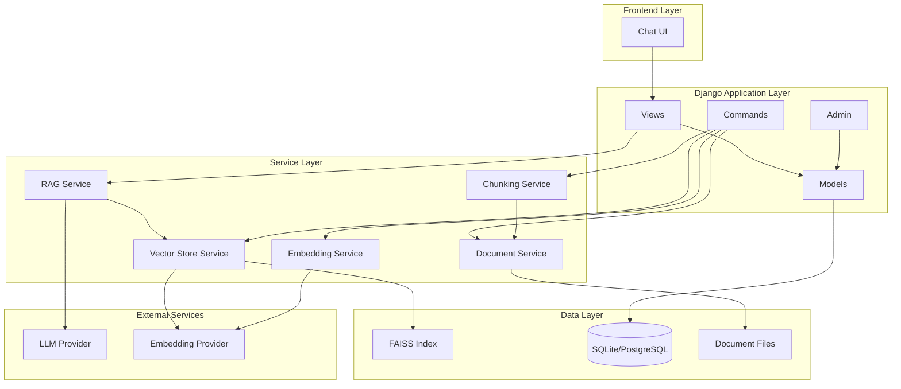

# Django AI Chat Application with RAG - Implementation Plan

## Project Overview

A production-ready Django application that implements Retrieval-Augmented Generation (RAG) using FAISS as the vector database. The application supports multiple embedding providers (OpenAI, Gemini, HuggingFace) and provides a chat interface for querying indexed documents.

## Architecture Diagram



## Directory Structure

```
djgent-chat/
├── config/
│   ├── __init__.py
│   ├── asgi.py
│   ├── settings.py
│   ├── urls.py
│   └── wsgi.py
├── chat/
│   ├── __init__.py
│   ├── apps.py
│   ├── models.py
│   ├── views.py
│   ├── urls.py
│   ├── admin.py
│   ├── forms.py
│   ├── services/
│   │   ├── __init__.py
│   │   ├── base.py
│   │   ├── embedding_service.py
│   │   ├── vector_store_service.py
│   │   ├── document_service.py
│   │   ├── chunking_service.py
│   │   └── rag_service.py
│   ├── utils/
│   │   ├── __init__.py
│   │   ├── config.py
│   │   └── helpers.py
│   ├── management/
│   │   └── commands/
│   │       └── index_documents.py
│   ├── templates/
│   │   └── chat/
│   │       ├── base.html
│   │       ├── chat.html
│   │       └── settings.html
│   └── static/
│       └── chat/
│           ├── css/
│           │   └── chat.css
│           └── js/
│               └── chat.js
├── data/
│   └── documents/
├── faiss_indexes/
├── .env.example
├── .gitignore
├── manage.py
├── pyproject.toml
├── requirements.txt
└── README.md
```

## Component Specifications

### 1. Models (`chat/models.py`)

#### RAGConfiguration Model
Stores user-configurable RAG settings:
- `rag_folder_name`: Path to documents folder
- `embedding_provider`: Choice field (openai, gemini, huggingface)
- `llm_provider`: Choice field (openai, gemini, anthropic)
- `chunk_size`: Integer (default: 1000)
- `chunk_overlap`: Integer (default: 200)
- `top_k`: Integer (default: 5)
- `created_at`, `updated_at`: Timestamps

#### ChatMessage Model
Stores chat history:
- `session_id`: UUID for conversation grouping
- `role`: Choice (user, assistant)
- `content`: Text content
- `context_used`: JSON field storing retrieved chunks
- `created_at`: Timestamp

### 2. Embedding Service (`chat/services/embedding_service.py`)

Abstract base class `EmbeddingProvider` with methods:
- `embed_text(text: str) -> List[float]`
- `embed_batch(texts: List[str]) -> List[List[float]]`
- `get_dimension() -> int`

Concrete implementations:
- `OpenAIEmbeddingProvider`: Uses OpenAI embeddings API
- `GeminiEmbeddingProvider`: Uses Google Gemini embeddings
- `HuggingFaceEmbeddingProvider`: Uses sentence-transformers locally

Factory function `get_embedding_provider()` returns appropriate provider based on settings.

### 3. Vector Store Service (`chat/services/vector_store_service.py`)

`FAISSVectorStore` class with methods:
- `__init__(index_path: str, embedding_provider: EmbeddingProvider)`
- `create_index(dimension: int)`
- `load_index() -> bool`
- `save_index()`
- `add_vectors(vectors: List[List[float]], metadata: List[Dict])`
- `search(query_vector: List[float], k: int) -> List[Dict]`
- `delete_index()`

Metadata structure:
```python
{
    "file_name": str,
    "chunk_id": int,
    "source_path": str,
    "text": str
}
```

### 4. Document Service (`chat/services/document_service.py`)

`DocumentLoader` class with methods:
- `load_document(file_path: str) -> str`
- `load_documents_from_folder(folder_path: str) -> Dict[str, str]`
- `get_supported_extensions() -> List[str]`

Supported loaders:
- PDF: PyPDF2 or pdfplumber
- TXT: Built-in file reading
- MD: Built-in file reading
- DOCX: python-docx

### 5. Chunking Service (`chat/services/chunking_service.py`)

`TextChunker` class with methods:
- `__init__(chunk_size: int, chunk_overlap: int)`
- `chunk_text(text: str, metadata: Dict) -> List[Dict]`
- `chunk_by_character(text: str, metadata: Dict) -> List[Dict]`
- `chunk_by_sentence(text: str, metadata: Dict) -> List[Dict]`

Chunk structure:
```python
{
    "text": str,
    "chunk_id": int,
    "file_name": str,
    "source_path": str
}
```

### 6. RAG Service (`chat/services/rag_service.py`)

`RAGService` class with methods:
- `__init__(config: RAGConfiguration)`
- `query(question: str, session_id: str) -> Dict`
- `get_context(question: str) -> List[Dict]`
- `generate_response(question: str, context: List[Dict]) -> str`
- `save_conversation(session_id: str, role: str, content: str, context: List[Dict])`

### 7. Management Command (`chat/management/commands/index_documents.py`)

Command: `python manage.py index_documents`

Arguments:
- `--folder`: Path to documents folder (optional, uses config default)
- `--reindex`: Force re-indexing (overwrite existing index)
- `--chunk-size`: Override default chunk size
- `--chunk-overlap`: Override default chunk overlap

Process flow:
1. Load configuration
2. Initialize services
3. Load documents from folder
4. Chunk documents
5. Generate embeddings
6. Create/update FAISS index
7. Save index to disk
8. Report statistics

### 8. Views (`chat/views.py`)

- `ChatView`: Main chat interface
- `SettingsView`: Configure RAG settings
- `APIView`: AJAX endpoint for chat messages
- `IndexStatusView`: Show indexing status

### 9. Templates

#### `base.html`
Base template with Bootstrap CDN, common layout

#### `chat.html`
Chat interface with:
- Message display area
- Input form
- Settings toggle
- Loading indicators

#### `settings.html`
Settings form for RAG configuration

### 10. Settings Configuration

Add to `config/settings.py`:
```python
# RAG Configuration
RAG_FAISS_INDEX_BASE_PATH = BASE_DIR / 'faiss_indexes'
RAG_DOCUMENTS_BASE_PATH = BASE_DIR / 'data' / 'documents'

# LLM Configuration
LLM_PROVIDER = os.getenv('LLM_PROVIDER', 'openai')
OPENAI_API_KEY = os.getenv('OPENAI_API_KEY')
GEMINI_API_KEY = os.getenv('GEMINI_API_KEY')
ANTHROPIC_API_KEY = os.getenv('ANTHROPIC_API_KEY')

# Embedding Configuration
EMBEDDING_PROVIDER = os.getenv('EMBEDDING_PROVIDER', 'openai')
HUGGINGFACE_MODEL_NAME = os.getenv('HUGGINGFACE_MODEL_NAME', 'all-MiniLM-L6-v2')

# Chunking Configuration
DEFAULT_CHUNK_SIZE = int(os.getenv('DEFAULT_CHUNK_SIZE', 1000))
DEFAULT_CHUNK_OVERLAP = int(os.getenv('DEFAULT_CHUNK_OVERLAP', 200))
DEFAULT_TOP_K = int(os.getenv('DEFAULT_TOP_K', 5))
```

## Dependencies

```
django>=6.0.1
faiss-cpu>=1.7.4
langchain>=0.1.0
langchain-openai>=0.0.5
langchain-google-genai>=0.0.6
sentence-transformers>=2.3.1
python-dotenv>=1.0.0
PyPDF2>=3.0.1
python-docx>=1.1.0
openai>=1.10.0
google-generativeai>=0.3.2
anthropic>=0.18.0
```

## Usage Flow

### Initial Setup
1. Install dependencies
2. Configure `.env` file with API keys
3. Run migrations
4. Create RAG configuration via admin or settings page

### Indexing Documents
```bash
python manage.py index_documents --folder /path/to/documents --reindex
```

### Chat Interface
1. Navigate to `/chat/`
2. Type question and submit
3. System retrieves relevant chunks from FAISS
4. LLM generates response with context
5. Response displayed with source references

## Error Handling

- Graceful handling of missing API keys
- Validation of document paths
- FAISS index corruption recovery
- Rate limiting for API calls
- Logging for debugging

## Security Considerations

- API keys stored in environment variables
- Document path validation to prevent directory traversal
- CSRF protection for all forms
- Session-based authentication for chat history
- Input sanitization for user queries

## Testing Strategy

- Unit tests for each service
- Integration tests for RAG pipeline
- E2E tests for chat interface
- Mock external API calls in tests

## Future Enhancements

- Multi-user support with authentication
- Document upload via web interface
- Streaming responses
- Conversation history management
- Export chat sessions
- Support for more document types
- Hybrid search (keyword + semantic)
