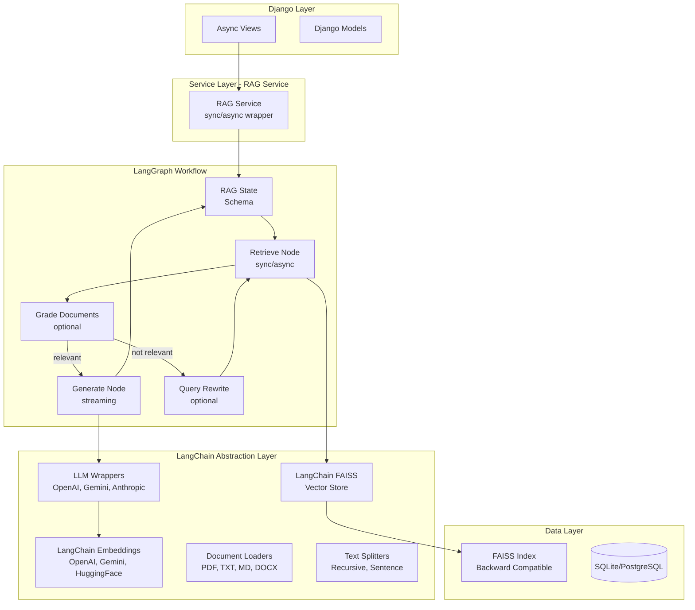

# LangChain/LangGraph Migration Plan

## Overview

This plan outlines the migration of the existing Django chat application from custom implementations to LangChain and LangGraph workflow. The migration will maintain backward compatibility with existing FAISS indexes while leveraging LangChain's abstractions for better maintainability and future extensibility.

## Architecture Diagram



## New Directory Structure

```
chat/
├── services/
│   ├── __init__.py
│   ├── embedding_service.py          # Updated with LangChain wrappers
│   ├── vector_store_service.py       # Updated with LangChain FAISS
│   ├── document_service.py           # Updated with LangChain loaders
│   ├── chunking_service.py           # Updated with LangChain splitters
│   ├── rag_service.py                # Updated with LangChain/LangGraph
│   ├── langchain_base.py             # New - Base LangChain classes
│   └── langgraph_workflow.py         # New - LangGraph workflow
├── langgraph/                        # New - LangGraph components
│   ├── __init__.py
│   ├── state.py                      # RAG state schema
│   ├── nodes/
│   │   ├── __init__.py
│   │   ├── retrieve.py               # Document retrieval node
│   │   ├── generate.py               # Response generation node
│   │   ├── grade.py                  # Document grading node
│   │   └── rewrite.py                # Query rewrite node
│   └── graph.py                      # Workflow graph assembly
└── ...
```

## Step-by-Step Implementation

### 1. Update Dependencies

**File: `pyproject.toml`**
```toml
[project]
name = "djgent-chat"
version = "0.2.0"
requires-python = ">=3.12"
dependencies = [
    "django>=6.0.1",
    "faiss-cpu>=1.7.4",
    # LangChain core
    "langchain>=0.2.0",
    "langchain-core>=0.2.0",
    # LangChain community (for integrations)
    "langchain-community>=0.2.0",
    # LangGraph
    "langgraph>=0.1.0",
    # LLM Providers
    "langchain-openai>=0.1.0",
    "langchain-google-genai>=0.1.0",
    "langchain-anthropic>=0.1.0",
    # Document processing
    "PyPDF2>=3.0.1",
    "python-docx>=1.1.0",
    # Environment
    "python-dotenv>=1.0.0",
    "numpy>=1.24.0",
]
```

**File: `requirements.txt`**
```
# Add these to existing requirements
langchain>=0.2.0
langchain-core>=0.2.0
langchain-community>=0.2.0
langgraph>=0.1.0
langchain-openai>=0.1.0
langchain-google-genai>=0.1.0
langchain-anthropic>=0.1.0
```

### 2. LangChain Embedding Service Wrapper

**File: `chat/services/langchain_embeddings.py`**

```python
"""
LangChain-compatible embedding providers with sync/async support.
"""

from typing import List, Optional
from langchain_core.embeddings import Embeddings
from langchain_openai import OpenAIEmbeddings
from langchain_google_genai import GoogleGenerativeAIEmbeddings
from sentence_transformers import SentenceTransformer

from django.conf import settings


class LangChainEmbeddingProvider(Embeddings):
    """Base wrapper for custom embedding providers."""
    
    def __init__(self, provider_name: str, model_name: Optional[str] = None):
        self.provider_name = provider_name
        self.model_name = model_name
        self._instance = None
    
    def _get_instance(self):
        """Get the underlying embedding provider instance."""
        if self._instance is None:
            from .embedding_service import get_embedding_provider
            self._instance = get_embedding_provider(
                self.provider_name,
                self.model_name
            )
        return self._instance
    
    def embed_documents(self, texts: List[str]) -> List[List[float]]:
        """Embed a list of texts (documents)."""
        instance = self._get_instance()
        return instance.embed_batch(texts)
    
    async def aembed_documents(self, texts: List[str]) -> List[List[float]]:
        """Async embed a list of texts."""
        return self.embed_documents(texts)
    
    def embed_query(self, text: str) -> List[float]:
        """Embed a single query text."""
        instance = self._get_instance()
        return instance.embed_text(text)
    
    async def aembed_query(self, text: str) -> List[float]:
        """Async embed a single query text."""
        return self.embed_query(text)


class HuggingFaceLangChainEmbeddings(Embeddings):
    """LangChain-compatible HuggingFace embeddings."""
    
    def __init__(self, model_name: str = "all-MiniLM-L6-v2", device: str = "cpu"):
        self.model_name = model_name
        self.device = device
        self._model = None
    
    def _get_model(self):
        if self._model is None:
            self._model = SentenceTransformer(self.model_name, device=self.device)
        return self._model
    
    def embed_documents(self, texts: List[str]) -> List[List[float]]:
        model = self._get_model()
        embeddings = model.encode(texts, convert_to_numpy=True)
        return embeddings.tolist()
    
    async def aembed_documents(self, texts: List[str]) -> List[List[float]]:
        return self.embed_documents(texts)
    
    def embed_query(self, text: str) -> List[float]:
        model = self._get_model()
        embedding = model.encode(text, convert_to_numpy=True)
        return embedding.tolist()
    
    async def aembed_query(self, text: str) -> List[float]:
        return self.embed_query(text)


def get_langchain_embeddings(provider: Optional[str] = None) -> Embeddings:
    """Factory function to get LangChain-compatible embeddings."""
    provider = provider or getattr(settings, 'EMBEDDING_PROVIDER', 'openai')
    
    if provider == 'openai':
        return OpenAIEmbeddings(
            model="text-embedding-3-small",
            api_key=getattr(settings, 'OPENAI_API_KEY', None)
        )
    elif provider == 'gemini':
        return GoogleGenerativeAIEmbeddings(
            model="models/text-embedding-004",
            google_api_key=getattr(settings, 'GEMINI_API_KEY', None)
        )
    elif provider == 'huggingface':
        model_name = getattr(settings, 'HUGGINGFACE_MODEL_NAME', 'all-MiniLM-L6-v2')
        return HuggingFaceLangChainEmbeddings(model_name=model_name)
    else:
        return LangChainEmbeddingProvider(provider)
```

### 3. LangChain FAISS Vector Store

**File: `chat/services/langchain_vectorstore.py`**

```python
"""
LangChain-compatible FAISS vector store with backward compatibility.
"""

from typing import List, Optional, Dict, Any
from pathlib import Path
from langchain_core.vectorstores import VectorStore
from langchain_core.documents import Document
from langchain_core.embeddings import Embeddings

from django.conf import settings


class LangChainFAISS(VectorStore):
    """LangChain-compatible FAISS vector store with backward compatibility."""
    
    def __init__(
        self,
        embedding: Embeddings,
        index_path: str,
        index_type: str = 'flat'
    ):
        self.embedding = embedding
        self.index_path = Path(index_path)
        self.index_type = index_type.lower()
        self.index_file = self.index_path / 'index.faiss'
        self.metadata_file = self.index_path / 'metadata.pkl'
        self._index = None
        self._docstore = {}
    
    def _load_index(self):
        """Load existing FAISS index."""
        import faiss
        import pickle
        
        if not self.index_file.exists():
            return None
        
        self._index = faiss.read_index(str(self.index_file))
        
        with open(self.metadata_file, 'rb') as f:
            self._docstore = pickle.load(f)
        
        return self._index
    
    def _save_index(self):
        """Save FAISS index to disk."""
        import faiss
        import pickle
        
        self.index_path.mkdir(parents=True, exist_ok=True)
        faiss.write_index(self._index, str(self.index_file))
        
        with open(self.metadata_file, 'wb') as f:
            pickle.dump(self._docstore, f)
    
    @property
    def docstore(self) -> Dict[str, Document]:
        return getattr(self, '_docstore', {})
    
    def add_texts(
        self,
        texts: List[str],
        metadatas: Optional[List[Dict]] = None,
        ids: Optional[List[str]] = None,
        **kwargs
    ) -> List[str]:
        """Add texts to the vector store."""
        import numpy as np
        
        if self._index is None:
            self._load_index()
        
        if self._index is None:
            embeddings = self.embedding.embed_documents(texts[:1])
            dimension = len(embeddings[0])
            self._create_index(dimension)
        
        embeddings = self.embedding.embed_documents(texts)
        embeddings_array = np.array(embeddings, dtype='float32')
        
        start_id = self._index.ntotal
        self._index.add(embeddings_array)
        
        ids = ids or [str(i) for i in range(start_id, start_id + len(texts))]
        metadatas = metadatas or [{}] * len(texts)
        
        for i, (text, metadata, id_) in enumerate(zip(texts, metadatas, ids)):
            self._docstore[id_] = Document(page_content=text, metadata=metadata)
        
        self._save_index()
        return ids
    
    async def aadd_texts(
        self,
        texts: List[str],
        metadatas: Optional[List[Dict]] = None,
        ids: Optional[List[str]] = None,
        **kwargs
    ) -> List[str]:
        return self.add_texts(texts, metadatas, ids, **kwargs)
    
    def similarity_search(
        self,
        query: str,
        k: int = 4,
        **kwargs
    ) -> List[Document]:
        """Search for similar documents."""
        query_embedding = self.embedding.embed_query(query)
        return self.similarity_search_by_vector(query_embedding, k)
    
    async def asimilarity_search(
        self,
        query: str,
        k: int = 4,
        **kwargs
    ) -> List[Document]:
        return self.similarity_search(query, k)
    
    def similarity_search_by_vector(
        self,
        embedding: List[float],
        k: int = 4,
        **kwargs
    ) -> List[Document]:
        """Search by vector embedding."""
        import numpy as np
        
        if self._index is None:
            self._load_index()
        
        if self._index is None or self._index.ntotal == 0:
            return []
        
        query_array = np.array([embedding], dtype='float32')
        k = min(k, self._index.ntotal)
        distances, indices = self._index.search(query_array, k)
        
        results = []
        for i, idx in enumerate(indices[0]):
            if idx == -1:
                continue
            doc_id = str(idx)
            if doc_id in self.docstore:
                doc = self.docstore[doc_id]
                doc.metadata['score'] = float(distances[0][i])
                results.append(doc)
        
        return results
    
    def _create_index(self, dimension: int):
        """Create a new FAISS index."""
        import faiss
        
        if self.index_type == 'flat':
            self._index = faiss.IndexFlatL2(dimension)
        elif self.index_type == 'ivf':
            quantizer = faiss.IndexFlatL2(dimension)
            nlist = min(100, dimension)
            self._index = faiss.IndexIVFFlat(quantizer, dimension, nlist)
        elif self.index_type == 'hnsw':
            self._index = faiss.IndexHNSWFlat(dimension, 32)
        else:
            self._index = faiss.IndexFlatL2(dimension)


def get_langchain_faiss(
    embedding: Embeddings,
    folder_name: str,
    index_base_path: Optional[str] = None
) -> 'LangChainFAISS':
    """Factory function to get LangChain FAISS vector store."""
    if index_base_path is None:
        index_base_path = getattr(settings, 'RAG_FAISS_INDEX_BASE_PATH', 'faiss_indexes')
    
    safe_folder_name = folder_name.replace('/', '_').replace('\\', '_')
    index_path = Path(index_base_path) / safe_folder_name
    
    return LangChainFAISS(
        embedding=embedding,
        index_path=str(index_path)
    )
```

### 4. LangGraph RAG State Schema

**File: `chat/langgraph/state.py`**

```python
"""
RAG state schema for LangGraph workflow.
"""

from typing import List, Optional, Dict, Any
from pydantic import BaseModel, Field
from langchain_core.messages import BaseMessage, HumanMessage, AIMessage
from langchain_core.documents import Document


class RAGState(BaseModel):
    """State for the RAG workflow."""
    
    messages: List[BaseMessage] = Field(default_factory=list)
    current_question: str = Field(default="")
    documents: List[Document] = Field(default_factory=list)
    question_embedding: Optional[List[float]] = Field(default=None)
    context_str: str = Field(default="")
    answer: str = Field(default="")
    sources: List[Dict[str, Any]] = Field(default_factory=list)
    iterations: int = Field(default=0)
    max_iterations: int = Field(default=2)
    error: Optional[str] = Field(default=None)
    session_id: Optional[str] = Field(default=None)
    
    class Config:
        arbitrary_types_allowed = True
    
    def add_user_message(self, question: str):
        self.current_question = question
        self.messages.append(HumanMessage(content=question))
    
    def add_assistant_message(self, answer: str):
        self.messages.append(AIMessage(content=answer))
        self.answer = answer
    
    def get_conversation_context(self) -> str:
        context_parts = []
        for msg in self.messages[-5:]:
            if isinstance(msg, HumanMessage):
                context_parts.append(f"Human: {msg.content}")
            elif isinstance(msg, AIMessage):
                context_parts.append(f"Assistant: {msg.content}")
        return "\n".join(context_parts)
```

### 5. LangGraph Nodes

**File: `chat/langgraph/nodes/retrieve.py`**

```python
"""
Document retrieval node for LangGraph workflow.
"""

from typing import List
from langchain_core.vectorstores import VectorStore
from langchain_core.documents import Document

from ..state import RAGState


class RetrieveNode:
    """Node for retrieving relevant documents."""
    
    def __init__(self, vector_store: VectorStore, k: int = 5):
        self.vector_store = vector_store
        self.k = k
    
    def __call__(self, state: RAGState) -> RAGState:
        question = state.current_question
        
        if not question:
            state.error = "No question provided"
            return state
        
        try:
            documents = self.vector_store.similarity_search(question, k=self.k)
            state.documents = documents
            
            context_parts = []
            for i, doc in enumerate(documents, 1):
                source = doc.metadata.get('file_name', f'Document {i}')
                chunk_id = doc.metadata.get('chunk_id', i)
                context_parts.append(
                    f"[Source: {source}, Chunk {chunk_id}]\n{doc.page_content}"
                )
            state.context_str = "\n\n".join(context_parts)
            
        except Exception as e:
            state.error = f"Retrieval error: {str(e)}"
        
        return state
    
    async def ainvoke(self, state: RAGState) -> RAGState:
        return self(state)


def create_retrieve_node(vector_store: VectorStore, k: int = 5) -> RetrieveNode:
    return RetrieveNode(vector_store, k)
```

**File: `chat/langgraph/nodes/generate.py`**

```python
"""
Response generation node for LangGraph workflow.
"""

from typing import Optional, AsyncGenerator
from langchain_core.output_parsers import StrOutputParser
from langchain_core.prompts import ChatPromptTemplate
from langchain_core.language_models import BaseChatModel

from ..state import RAGState


class GenerateNode:
    """Node for generating responses using LLM."""
    
    def __init__(self, llm: BaseChatModel, system_prompt: Optional[str] = None):
        self.llm = llm
        self.system_prompt = system_prompt or (
            "You are a helpful assistant that answers questions based on "
            "provided context. If the context doesn't contain enough information "
            "to answer the question, please say so."
        )
        
        self.prompt = ChatPromptTemplate.from_messages([
            ("system", self.system_prompt),
            ("human", """Context from documents:
{context}

Conversation history:
{conversation}

Question: {question}

Please answer the question based on the provided context.""")
        ])
        
        self.chain = self.prompt | self.llm | StrOutputParser()
    
    def __call__(self, state: RAGState) -> RAGState:
        try:
            conversation = state.get_conversation_context()
            
            answer = self.chain.invoke({
                "context": state.context_str,
                "conversation": conversation,
                "question": state.current_question
            })
            
            state.answer = answer
            state.add_assistant_message(answer)
            
            state.sources = []
            seen = set()
            for doc in state.documents:
                file_name = doc.metadata.get('file_name', 'Unknown')
                if file_name not in seen:
                    state.sources.append({
                        'file_name': file_name,
                        'source_path': doc.metadata.get('source_path', ''),
                        'chunk_count': 1
                    })
                    seen.add(file_name)
            
        except Exception as e:
            state.error = f"Generation error: {str(e)}"
        
        return state
    
    async def ainvoke(self, state: RAGState) -> RAGState:
        return self(state)
    
    async def astream(self, state: RAGState) -> AsyncGenerator[str, None]:
        conversation = state.get_conversation_context()
        
        async for chunk in self.chain.astream({
            "context": state.context_str,
            "conversation": conversation,
            "question": state.current_question
        }):
            yield chunk


def create_generate_node(llm: BaseChatModel, system_prompt: Optional[str] = None) -> GenerateNode:
    return GenerateNode(llm, system_prompt)
```

### 6. LangGraph Workflow Assembly

**File: `chat/langgraph/workflow.py`**

```python
"""
LangGraph RAG workflow assembly.
"""

from typing import Optional, Dict, Any
from langgraph.graph import StateGraph, END
from langgraph.checkpoint.memory import MemorySaver

from .state import RAGState
from .nodes.retrieve import create_retrieve_node
from .nodes.generate import create_generate_node
from langchain_core.vectorstores import VectorStore
from langchain_core.language_models import BaseChatModel


class RAGWorkflow:
    """LangGraph-based RAG workflow."""
    
    def __init__(
        self,
        vector_store: VectorStore,
        llm: BaseChatModel,
        config: Optional[Dict[str, Any]] = None
    ):
        self.vector_store = vector_store
        self.llm = llm
        self.config = config or {}
        self.k = self.config.get('top_k', 5)
        self.max_iterations = self.config.get('max_iterations', 2)
        self.graph = self._build_graph()
    
    def _build_graph(self) -> StateGraph:
        retrieve_node = create_retrieve_node(self.vector_store, self.k)
        generate_node = create_generate_node(self.llm)
        
        workflow = StateGraph(RAGState)
        workflow.add_node("retrieve", retrieve_node)
        workflow.add_node("generate", generate_node)
        workflow.set_entry_point("retrieve")
        workflow.add_edge("retrieve", "generate")
        workflow.add_edge("generate", END)
        
        memory = MemorySaver()
        return workflow.compile(checkpointer=memory)
    
    def invoke(
        self,
        question: str,
        session_id: Optional[str] = None,
        config: Optional[Dict[str, Any]] = None
    ) -> RAGState:
        initial_state = RAGState(
            current_question=question,
            session_id=session_id,
            max_iterations=self.max_iterations
        )
        initial_state.add_user_message(question)
        
        config = config or {}
        config["configurable"] = {"thread_id": session_id or "default"}
        
        return self.graph.invoke(initial_state, config=config)
    
    async def ainvoke(
        self,
        question: str,
        session_id: Optional[str] = None,
        config: Optional[Dict[str, Any]] = None
    ) -> RAGState:
        initial_state = RAGState(
            current_question=question,
            session_id=session_id,
            max_iterations=self.max_iterations
        )
        initial_state.add_user_message(question)
        
        config = config or {}
        config["configurable"] = {"thread_id": session_id or "default"}
        
        return await self.graph.ainvoke(initial_state, config=config)
    
    def stream(
        self,
        question: str,
        session_id: Optional[str] = None
    ):
        initial_state = RAGState(current_question=question, session_id=session_id)
        initial_state.add_user_message(question)
        
        config = {"configurable": {"thread_id": session_id or "default"}}
        return self.graph.stream(initial_state, config=config)


def create_rag_workflow(
    vector_store: VectorStore,
    llm: BaseChatModel,
    config: Optional[Dict[str, Any]] = None
) -> RAGWorkflow:
    return RAGWorkflow(vector_store, llm, config)
```

### 7. Async RAG Service

**File: `chat/services/rag_service.py` (updated)**

```python
"""
RAG Service with LangChain/LangGraph support and async operations.
"""

import logging
from typing import Dict, Any, Optional
from django.conf import settings

from .langchain_embeddings import get_langchain_embeddings
from .langchain_vectorstore import get_langchain_faiss
from .langgraph.workflow import create_rag_workflow
from langchain_openai import ChatOpenAI
from langchain_google_genai import ChatGoogleGenerativeAI
from langchain_anthropic import ChatAnthropic

logger = logging.getLogger(__name__)


class LangChainRAGService:
    """RAG service using LangChain and LangGraph with sync/async support."""
    
    def __init__(self, config: Optional[Dict[str, Any]] = None):
        self.config = config or {}
        self.rag_folder_name = self.config.get('rag_folder_name', 'default')
        self.embedding_provider_name = self.config.get(
            'embedding_provider',
            getattr(settings, 'EMBEDDING_PROVIDER', 'openai')
        )
        self.llm_provider_name = self.config.get(
            'llm_provider',
            getattr(settings, 'LLM_PROVIDER', 'openai')
        )
        self.top_k = self.config.get('top_k', 5)
        self._init_components()
    
    def _init_components(self):
        self.embeddings = get_langchain_embeddings(self.embedding_provider_name)
        self.vector_store = get_langchain_faiss(
            embedding=self.embeddings,
            folder_name=self.rag_folder_name
        )
        self.llm = self._create_llm()
        self.workflow = create_rag_workflow(
            vector_store=self.vector_store,
            llm=self.llm,
            config={'top_k': self.top_k}
        )
    
    def _create_llm(self):
        if self.llm_provider_name == 'openai':
            api_key = getattr(settings, 'OPENAI_API_KEY', None)
            return ChatOpenAI(model='gpt-4o-mini', api_key=api_key, temperature=0.7)
        elif self.llm_provider_name == 'gemini':
            api_key = getattr(settings, 'GEMINI_API_KEY', None)
            return ChatGoogleGenerativeAI(model='gemini-1.5-flash', google_api_key=api_key)
        elif self.llm_provider_name == 'anthropic':
            api_key = getattr(settings, 'ANTHROPIC_API_KEY', None)
            return ChatAnthropic(model='claude-3-haiku-20240307', api_key=api_key)
        else:
            raise ValueError(f"Unsupported LLM provider: {self.llm_provider_name}")
    
    def query(
        self,
        question: str,
        session_id: Optional[str] = None
    ) -> Dict[str, Any]:
        """Query the RAG system synchronously."""
        try:
            state = self.workflow.invoke(question=question, session_id=session_id)
            
            context = [
                {'text': doc.page_content, 'metadata': doc.metadata}
                for doc in state.documents
            ]
            
            return {
                'answer': state.answer,
                'context': context,
                'sources': state.sources,
                'session_id': session_id,
                'error': state.error
            }
        except Exception as e:
            logger.error(f"Error in RAG query: {e}")
            return {'answer': '', 'context': [], 'sources': [], 'session_id': session_id, 'error': str(e)}
    
    async def aquery(
        self,
        question: str,
        session_id: Optional[str] = None
    ) -> Dict[str, Any]:
        """Query the RAG system asynchronously."""
        try:
            state = await self.workflow.ainvoke(question=question, session_id=session_id)
            
            context = [
                {'text': doc.page_content, 'metadata': doc.metadata}
                for doc in state.documents
            ]
            
            return {
                'answer': state.answer,
                'context': context,
                'sources': state.sources,
                'session_id': session_id,
                'error': state.error
            }
        except Exception as e:
            logger.error(f"Error in async RAG query: {e}")
            return {'answer': '', 'context': [], 'sources': [], 'session_id': session_id, 'error': str(e)}
    
    async def astream(self, question: str, session_id: Optional[str] = None):
        """Stream the RAG response asynchronously."""
        try:
            async for chunk in self.workflow.astream(question=question, session_id=session_id):
                if 'generate' in chunk and 'answer' in chunk['generate']:
                    yield chunk['generate']['answer']
        except Exception as e:
            logger.error(f"Error in streaming RAG: {e}")
            yield f"Error: {str(e)}"
    
    def is_index_ready(self) -> bool:
        return self.vector_store._index is not None or (
            self.vector_store.index_file.exists() and 
            self.vector_store.metadata_file.exists()
        )
    
    def get_index_stats(self) -> Dict[str, Any]:
        if self.vector_store._index is None:
            self.vector_store._load_index()
        
        if self.vector_store._index is None:
            return {'vector_count': 0, 'dimension': None, 'is_ready': False}
        
        return {
            'vector_count': self.vector_store._index.ntotal,
            'dimension': self.vector_store._index.d,
            'is_ready': True
        }


def get_rag_service(config: Optional[Dict[str, Any]] = None) -> LangChainRAGService:
    return LangChainRAGService(config)
```

### 8. Updated Django Views with Async Support

**File: `chat/views.py` (updated)**

```python
"""
Views for the chat application with async support.
"""

import uuid
import json
import asyncio
import logging
from django.shortcuts import render, redirect
from django.http import JsonResponse, StreamingHttpResponse
from django.views.decorators.csrf import csrf_exempt
from django.views.decorators.http import require_http_methods

from chat.models import RAGConfiguration, ChatMessage
from chat.utils import get_rag_config
from chat.services.rag_service import get_rag_service

logger = logging.getLogger(__name__)


async def chat_view_async(request):
    """Async chat interface view."""
    session_id = request.session.get('chat_session_id')
    if not session_id:
        session_id = str(uuid.uuid4())
        request.session['chat_session_id'] = session_id
    
    conversation = await asyncio.to_thread(
        ChatMessage.get_conversation, uuid.UUID(session_id)
    )
    
    index_status = await _get_index_status_async()
    
    return render(request, 'chat/chat.html', {
        'session_id': session_id,
        'conversation': conversation,
        'index_status': index_status,
    })


@csrf_exempt
@require_http_methods(["POST"])
async def chat_api_async(request):
    """Async API endpoint for sending chat messages."""
    try:
        data = json.loads(request.body)
        user_message = data.get('message', '').strip()
        session_id = data.get('session_id')
        stream = data.get('stream', False)
        
        if not user_message:
            return JsonResponse({'error': 'Message is required'}, status=400)
        
        if not session_id:
            session_id = request.session.get('chat_session_id')
            if not session_id:
                session_id = str(uuid.uuid4())
                request.session['chat_session_id'] = session_id
        
        session_uuid = uuid.UUID(session_id)
        
        await asyncio.to_thread(ChatMessage.create_user_message, session_uuid, user_message)
        
        config = get_rag_config()
        rag_service = get_rag_service(config)
        
        if not rag_service.is_index_ready():
            return JsonResponse({
                'error': 'No documents indexed.',
                'answer': 'I dont have any documents to search through.',
                'sources': [],
                'context': [],
            })
        
        if stream:
            return _stream_response(rag_service, user_message, session_id, session_uuid)
        
        result = await rag_service.aquery(user_message, session_id)
        
        await asyncio.to_thread(
            ChatMessage.create_assistant_message,
            session_uuid,
            result['answer'],
            context=result['context'],
            sources=result['sources']
        )
        
        return JsonResponse({
            'answer': result['answer'],
            'sources': result['sources'],
            'context': result['context'],
            'session_id': session_id,
        })
        
    except json.JSONDecodeError:
        return JsonResponse({'error': 'Invalid JSON'}, status=400)
    except Exception as e:
        logger.exception(f"Error in async chat API: {e}")
        return JsonResponse({'error': str(e)}, status=500)


def _stream_response(rag_service, user_message, session_id, session_uuid):
    """Helper to stream response."""
    async def generate():
        async for chunk in rag_service.astream(user_message, session_id):
            yield chunk
    
    return StreamingHttpResponse(generate(), content_type='text/event-stream')


async def _get_index_status_async():
    try:
        config = get_rag_config()
        rag_service = get_rag_service(config)
        stats = rag_service.get_index_stats()
        
        return {
            'is_ready': rag_service.is_index_ready(),
            'vector_count': stats.get('vector_count', 0),
            'dimension': stats.get('dimension'),
        }
    except Exception as e:
        logger.error(f"Error getting index status: {e}")
        return {'is_ready': False, 'vector_count': 0, 'dimension': None}
```

## Summary

This migration plan provides:

1. **LangChain Integration**: All services wrapped with LangChain interfaces
2. **LangGraph Workflow**: State-based workflow with nodes for retrieval and generation
3. **Sync/Async Support**: All operations support both synchronous and asynchronous execution
4. **Streaming**: Response streaming support for better UX
5. **Backward Compatibility**: Existing FAISS indexes will continue to work
6. **Django Async Views**: Proper async view support for Django 6.0

The implementation can be done incrementally, starting with dependencies and foundational services, then moving to LangGraph workflow, and finally updating views and commands.
