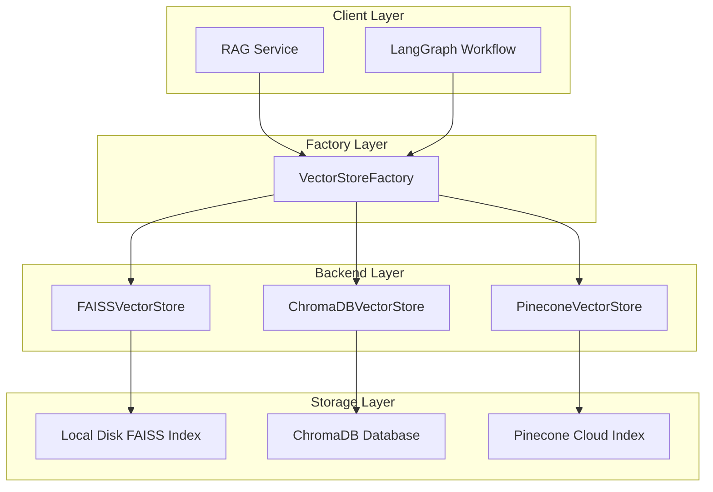

# Multi-Backend Vector Storage Implementation Plan

## Overview
Refactor the vector storage service to support multiple backends (FAISS, ChromaDB, Pinecone) with FAISS as the default, using a factory pattern for dynamic backend selection.

## Architecture



## Implementation Steps

### Step 1: Create Abstract Base Class
**File**: `chat/services/vectorstore/base.py`

Define a common interface that all vector store backends must implement:

```python
from abc import ABC, abstractmethod
from typing import Any, Dict, List, Optional
from langchain_core.documents import Document

class BaseVectorStore(ABC):
    @abstractmethod
    def add_texts(self, texts: List[str], metadatas: Optional[List[Dict]] = None, ids: Optional[List[str]] = None) -> List[str]:
        pass
    
    @abstractmethod
    def similarity_search(self, query: str, k: int = 4) -> List[Document]:
        pass
    
    @abstractmethod
    def similarity_search_by_vector(self, embedding: List[float], k: int = 4) -> List[Document]:
        pass
    
    @abstractmethod
    def delete_collection(self) -> None:
        pass
    
    @abstractmethod
    def get_vector_count(self) -> int:
        pass
    
    @abstractmethod
    def is_loaded(self) -> bool:
        pass
```

### Step 2: Create FAISSVectorStore (Refactor)
**File**: `chat/services/vectorstore/faiss.py`

Refactor existing FAISS implementation to use the base class interface. Keep most of the existing logic but adapt to the new interface.

**Key changes**:
- Extend `BaseVectorStore`
- Keep existing `_load_index`, `_save_index`, `_create_index` methods
- Implement required abstract methods

### Step 3: Create ChromaDBVectorStore
**File**: `chat/services/vectorstore/chromadb.py`

New implementation for ChromaDB:

```python
class ChromaDBVectorStore(BaseVectorStore):
    def __init__(self, embedding, collection_name: str, persist_directory: Optional[str] = None):
        import chromadb
        self.client = chromadb.PersistentClient(path=persist_directory)
        self.collection = self.client.get_or_create_collection(collection_name)
    
    # Implement all abstract methods using ChromaDB API
```

### Step 4: Create PineconeVectorStore
**File**: `chat/services/vectorstore/pinecone.py`

New implementation for Pinecone:

```python
class PineconeVectorStore(BaseVectorStore):
    def __init__(self, embedding, index_name: str, api_key: Optional[str] = None):
        import pinecone
        pinecone.init(api_key=api_key)
        self.index = pinecone.Index(index_name)
    
    # Implement all abstract methods using Pinecone API
```

### Step 5: Create VectorStoreFactory
**File**: `chat/services/vectorstore/factory.py`

Factory class for dynamic backend selection:

```python
from django.conf import settings

class VectorStoreFactory:
    @staticmethod
    def get_vector_store(
        backend: str = None,
        folder_name: str = "default",
        embedding = None,
        **kwargs
    ) -> BaseVectorStore:
        if backend is None:
            backend = getattr(settings, 'VECTOR_STORE_BACKEND', 'faiss')
        
        if backend == 'faiss':
            from .faiss import FAISSVectorStore
            return FAISSVectorStore(embedding=embedding, folder_name=folder_name, **kwargs)
        elif backend == 'chromadb':
            from .chromadb import ChromaDBVectorStore
            return ChromaDBVectorStore(embedding=embedding, collection_name=folder_name, **kwargs)
        elif backend == 'pinecone':
            from .pinecone import PineconeVectorStore
            return PineconeVectorStore(embedding=embedding, index_name=folder_name, **kwargs)
        else:
            raise ValueError(f"Unsupported vector store backend: {backend}")
```

### Step 6: Update Settings
**File**: `config/settings.py`

Add new configuration options:

```python
# Vector Store Configuration
VECTOR_STORE_BACKEND = os.getenv('VECTOR_STORE_BACKEND', 'faiss')  # 'faiss', 'chromadb', 'pinecone'

# ChromaDB Configuration (optional)
CHROMADB_PERSIST_DIRECTORY = os.getenv('CHROMADB_PERSIST_DIRECTORY', str(BASE_DIR / 'chromadb'))

# Pinecone Configuration (optional)
PINECONE_API_KEY = os.getenv('PINECONE_API_KEY')
PINECONE_ENVIRONMENT = os.getenv('PINECONE_ENVIRONMENT', 'us-east-1')
```

### Step 7: Update RAG Service
**File**: `chat/services/langchain_rag_service.py`

Update `_init_components` to use the factory:

```python
from .vectorstore.factory import VectorStoreFactory

# In _init_components:
self.vector_store = VectorStoreFactory.get_vector_store(
    backend=getattr(settings, 'VECTOR_STORE_BACKEND', 'faiss'),
    folder_name=self.rag_folder_name,
    embedding=self.embeddings
)
```

### Step 8: Update vector_store_service.py
**File**: `chat/services/vector_store_service.py`

Update factory function to use new factory:

```python
from .vectorstore.factory import VectorStoreFactory

def get_vector_store(
    folder_name: str,
    embedding_provider=None,
    index_base_path: Optional[str] = None,
    backend: Optional[str] = None,  # Add backend parameter
) -> BaseVectorStore:
    return VectorStoreFactory.get_vector_store(
        backend=backend,
        folder_name=folder_name,
        embedding=embedding_provider,
        index_base_path=index_base_path
    )
```

### Step 9: Update Requirements
**File**: `requirements.txt`

Add new dependencies:

```
# ChromaDB Vector Database
chromadb>=0.4.0

# Pinecone Vector Database
pinecone-client>=3.0.0
```

### Step 10: Update Directory Structure
**File**: Create new directory structure

```
chat/services/vectorstore/
├── __init__.py
├── base.py          # Abstract base class
├── faiss.py         # FAISS implementation
├── chromadb.py      # ChromaDB implementation
├── pinecone.py      # Pinecone implementation
└── factory.py       # Factory for backend selection
```

## Configuration Examples

### Using FAISS (Default)
```bash
# No environment variables needed - FAISS is default
export RAG_FOLDER_NAME=my_documents
```

### Using ChromaDB
```bash
export VECTOR_STORE_BACKEND=chromadb
export CHROMADB_PERSIST_DIRECTORY=/path/to/chromadb/data
export RAG_FOLDER_NAME=my_collection
```

### Using Pinecone
```bash
export VECTOR_STORE_BACKEND=pinecone
export PINECONE_API_KEY=your_api_key
export PINECONE_ENVIRONMENT=us-east-1
export RAG_FOLDER_NAME=my_index
```

## Backward Compatibility
- Existing code using `get_vector_store()` will continue to work
- Default backend is FAISS, maintaining current behavior
- All existing FAISS-specific methods remain available
